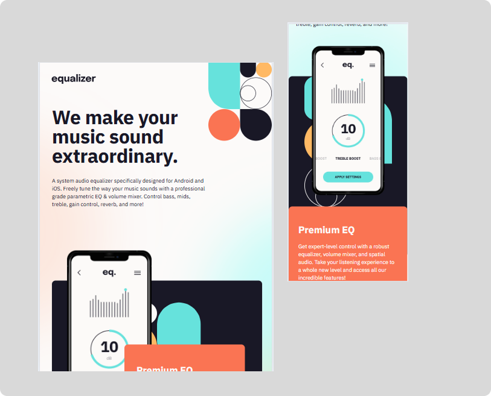

# Frontend Mentor - Equalizer landing page solution

This is a solution to the [Equalizer landing page challenge on Frontend Mentor](https://www.frontendmentor.io/challenges/equalizer-landing-page-7VJ4gp3DE). Frontend Mentor challenges help you improve your coding skills by building realistic projects. 

## Table of contents

- [Overview](#overview)
  - [The challenge](#the-challenge)
  - [Screenshot](#screenshot)
  - [Links](#links)
- [My process](#my-process)
  - [Built with](#built-with)
  - [What I learned](#what-i-learned)
  - [Useful resources](#useful-resources)
- [Author](#author)

## Overview

### The challenge

Users should be able to:

- View the optimal layout depending on their device's screen size
- See hover states for interactive elements

### Screenshot

### Links

- Deployed URL : https://equalizer-plum.vercel.app

## My process

### Built with

- Semantic HTML5 markup
- CSS custom properties
- Flexbox
- Tailwind CSS
- Mobile-first workflow
- [React](https://reactjs.org/)
- [Next.js](https://nextjs.org/) - React framework

### What I learned

#### Maintaining consictency based on Figma design

I learned translate UI/UX design into code with paying attention to the detail of the font size, spacing, posistion for responsivness on desktop, tablet and mobile screen 

#### Breaking down Section 2 into components

I broke Section 2 down into several components: `SecondSection`, `BackCard`, and `FrontCard`. `SecondSection` manages the positioning and relationships between elements; `BackCard` handles the card's background and pattern; and `FrontCard` handles the pricing information and download button. This separation makes the code easier to read, maintain, and adjust for different breakpoints.

#### Creating a reusable social icon

I created a `SocialIcon` function in footer to ensure all social media icons share a consistent structure and style. This function accepts `src` and `label` arguments, allowing a single component to be used for Facebook, Instagram, and Twitter without having to write the same markup repeatedly.

### Useful resources

- [Vercell](https://vercel.com/docs/cli/redeploy) - This helped me for deploying this project to vercel, learning the command that I have to use. 

## Author

- LinkedIn - [@desyayurianti](https://www.linkedin.com/in/desyayurianti)
- Intagram - [@_desyayuu](https://www.instagram.com/_desyayuu)

